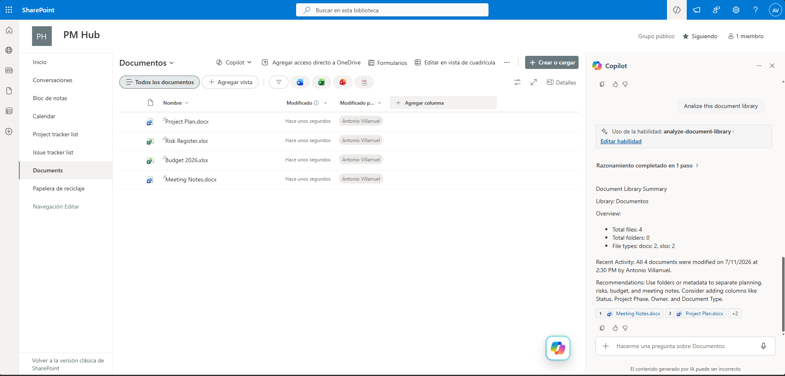

# Analyze Document Library

Analyzes a SharePoint document library and provides a structured summary of files, folders, activity, and organization recommendations.

## What you get

- Document library overview
- File and folder counts
- File type analysis
- Recent activity summary
- Organization recommendations
- Read-only analysis with no content changes

## SharePoint Skill

| Solution | Author(s) |
| --- | --- |
| analyze-document-library | Antonio Villarruel &#124; [GitHub](https://github.com/a-villarruel) |

## Version history

| Version | Date | Comments |
| --- | --- | --- |
| 1.0 | July 2026 | Initial Release |

## Disclaimer

*THIS CODE IS PROVIDED AS IS WITHOUT WARRANTY OF ANY KIND, EITHER EXPRESS OR IMPLIED, INCLUDING ANY IMPLIED WARRANTIES OF FITNESS FOR A PARTICULAR PURPOSE, MERCHANTABILITY, OR NON-INFRINGEMENT.*
